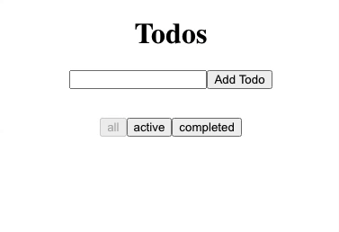

# Pursuit-Core-Web-Redux-Two-Lab

[](https://pursuit.org)

## Assignment

You'll be making a todo app using React and Redux.
Redux will store your todos and React will visualize them.

> Making a todo application is generally considered an important early rite of passage for understanding any state management library.

Users should be able to:

1. Create a Todo
2. Toggle a Todo between completed and uncompleted by clicking on it
   - Completed todos should be shown with ~line-through~ text

### Todo Schema

A Todo object should have the following properties:

```js
{
  completed: true
  id: 1,
  text: "Buy groceries",
}
```

### State

Your Redux state to store this information would look like:

```js
{
  nextTodoId: 1,
  todos: [],
}
```

## Bonus

Add three buttons that set a filter for which todos are visible:

- `"all"`: show all todos
- `"active"`: show todos that are active, not completed
- `"completed"`: show todos that are completed, not active

Store this setting as a `visibilityFilter` member in your Redux state.
Its default/initial value should be `"all"`.



## Getting Started

- Fork this repo
- Clone the forked repository
- `cd` to the directory where you cloned it
- `npm install` to install dependencies
- `npm run cypress` to open the cypress testing window
- `npm test` to run jest / node tests

> _Note_: Remember to `git add`, `git commit` and `git push` regularly

## Submission Guidelines

- When finished, commit and push your work.
- Make a pull request on github.
- Submit the link to your pull request on Canvas.
